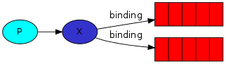
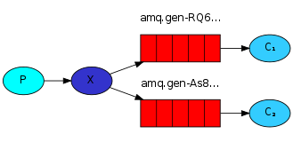
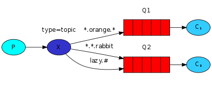

# RabbitMQ

## 기본 개념
- AMQP (Advanced Message Queuing Protocol): 시스템 간 메시지를 교환하기 위해 공개 표준으로 정의한 프로토콜
- Broker : 발행자가 만든 메시지를 저장
- Virtual Host : Broker 내의 가상 영역
- Connection : 발행자와 소비자, Broker 사이의 물리적인 연결
- Channel : 발행자와 소비자, Broker 사이의 논리적인 연결, 하나의 Connectoin 내에 다수의 Channel 설정 가능
- Exchange : 발행한 모든 메시지가 처음 도달하는 지점으로 메시지가 목적지에 도달할 수 있도록 라우팅 규칙 적용
- Queue : 메시지가 소비되기 전 대기하고 있는 최종 지점으로 Exchange 라우팅 규칙에 의해 단일 메시지가 복사되거나 다수의 큐에 도달
- Binding : Exchange 와 Queue 간의 가상 연결
* Exchange는 수신한 메시지를 이 Binding 규칙에 따라서 적당한 Queue 에 라우팅

## Exchange Type
### [Work Queues](https://www.rabbitmq.com/tutorials/tutorial-two-java.html)

- 라운드 로빈 방식으로 소비

### [Publish/Subscribe (Fanout)](https://www.rabbitmq.com/tutorials/tutorial-three-java.html)

- 바인딩이 되어있는 모든 큐에 메시지를 전송
- 메시지 브로드 캐스트 라우팅 방식


```java
private static final String EXCHANGE_NAME = "logs";
//channel.queueBind(QUEUE_NAME, ROUTING_KEY, BINDING_KEY);
channel.queueBind(QUEUE_NAME, EXCHANGE_NAME, "");
```
  
### [Routing](https://www.rabbitmq.com/tutorials/tutorial-four-java.html)

```java
channel.queueBind(QUEUE_NAME, EXCHANGE_NAME, "black");
```

- Fanout and will Broadcast

### [Topics](https://www.rabbitmq.com/tutorials/tutorial-five-java.html)

- `*`(star) can substitute for exactly one word.
- `#`(hash) can substitute for zero or more words.
```
Topic exchange
Topic exchange is powerful and can behave like other exchanges.

When a queue is bound with "#" (hash) binding key - it will receive all the messages, regardless of the routing key - like in fanout exchange.
When special characters, "*" (star) and "#" (hash), aren't used in bindings, the topic exchange will behave just like a direct one.
```